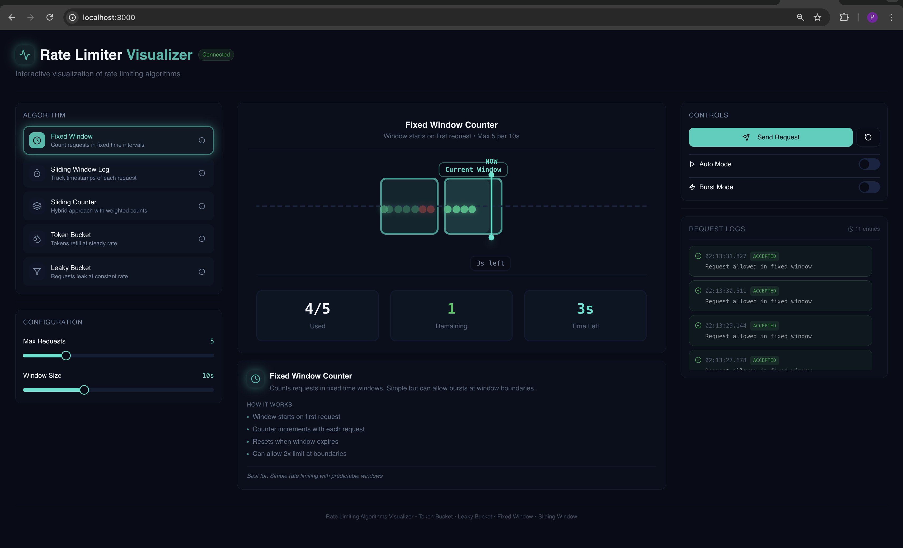
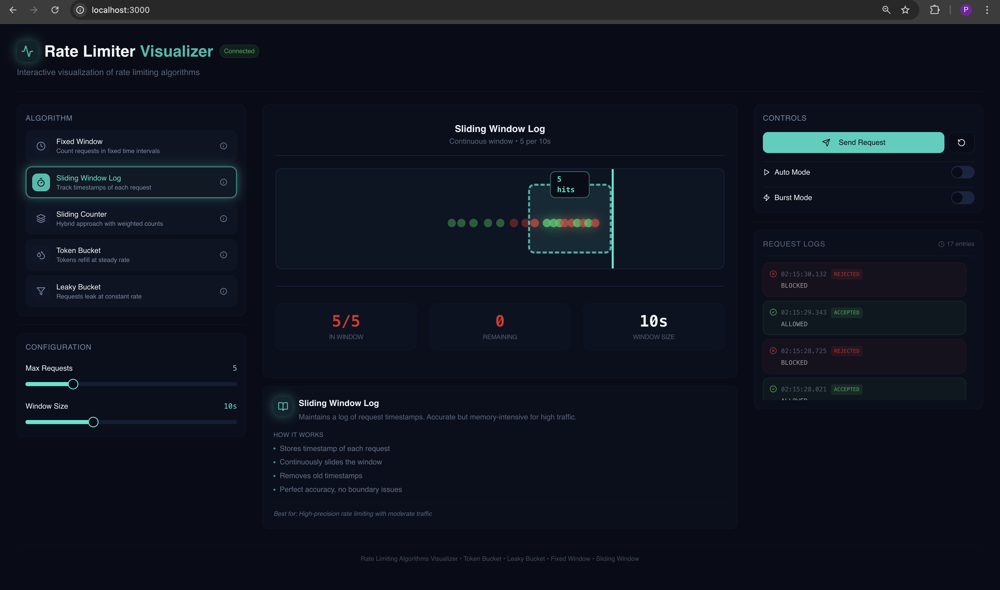
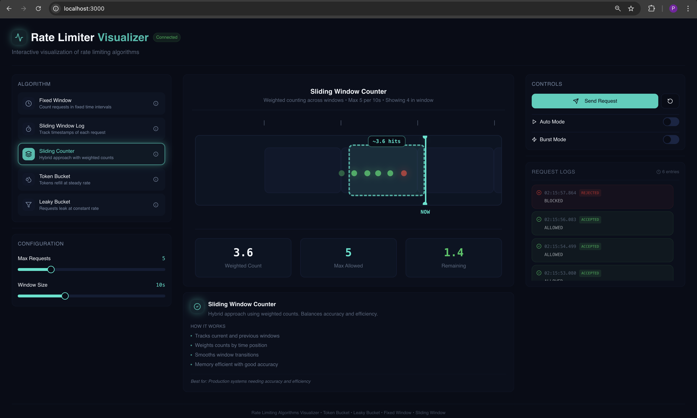
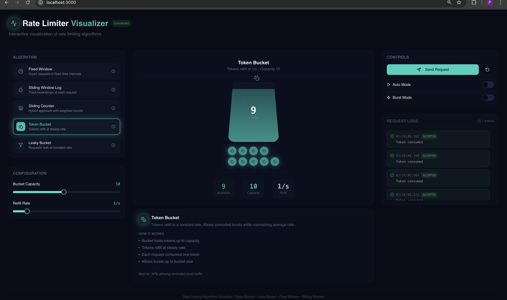
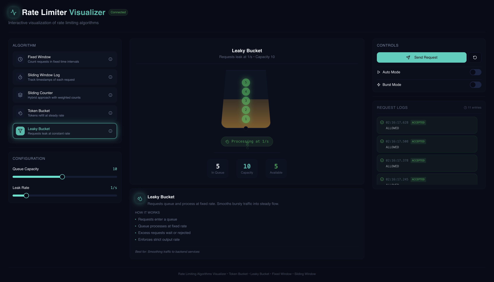

# 🚦 Rate Limiter Visualizer

Rate limiting is a **fundamental backend system design concept** used to control how frequently a client can access an API or service.
This project **implements real rate limiting algorithms on the backend** and **visualizes their behavior in real time on the frontend**, making abstract concepts intuitive and easy to reason about.


## 📽 Demo

🎥 **Project Recording**
[https://drive.google.com/file/d/1W0jT39CUNEDIaEak-3oMeD8qRct7BvPE/view?usp=sharing](https://drive.google.com/file/d/1W0jT39CUNEDIaEak-3oMeD8qRct7BvPE/view?usp=sharing)

📷 Screenshots for each algorithm are included below.


## 🧠 Rate Limiting (Brief)

**Rate limiting** restricts how many requests a client can make within a defined time window
(e.g., *5 requests per 10 seconds*).

It is critical for:

* Protecting services from abuse and traffic spikes
* Preventing system overload and cascading failures
* Ensuring fair usage across users
* Maintaining predictable performance and costs

This is a core building block in almost every large-scale backend system.


## 🧩 Implemented Rate Limiting Algorithms

> All algorithms below are **fully implemented in the backend**.
> The frontend reflects **real allow / block decisions**, not mocked behavior.


### 1️⃣ Fixed Window Counter

Counts requests in fixed intervals and resets at each window boundary.

📷 **Visualization**


---

### 2️⃣ Sliding Window Log

Stores request timestamps and counts only those within the rolling window.

📷 **Visualization**


---

### 3️⃣ Sliding Window Counter

Uses weighted counts from the current and previous window to smooth burst traffic.

📷 **Visualization**


---

### 4️⃣ Token Bucket

Requests are allowed while tokens are available, refilled at a steady rate.

📷 **Visualization**


---

### 5️⃣ Leaky Bucket

Processes requests at a constant rate and drops excess traffic on overflow.

📷 **Visualization**



## 🗂 Backend Design (LLD-Oriented)

The backend is structured to clearly demonstrate **Low-Level Design principles** such as separation of concerns, extensibility, and clean abstractions.

```
ratelimiter/
├── controller        // REST endpoints
├── dto               // API request/response models
├── enums             // Algorithm types
├── exception         // Centralized error handling
├── model             // Configuration & state models
├── service
│   ├── algorithm     // Rate limiting strategies
│   └── factory       // Algorithm selection (Factory pattern)
├── store             // In-memory state management
└── RateLimiterApplication.java
```

### Design Highlights

* **Strategy Pattern** for interchangeable rate limiting algorithms
* **Factory Pattern** for runtime algorithm selection
* Each algorithm maintains **its own isolated state**
* Clear separation between **API layer, logic, and storage**


## 🧰 Tech Stack

### Frontend

* React
* TypeScript
* Tailwind CSS
* Framer Motion
* Shadcn UI

### Backend

* Java 25
* Spring Boot
* REST APIs


## 🚀 Running the Project Locally

### Clone the Repository

```bash
git clone https://github.com/<your-username>/rate-limiter-visualizer.git
cd rate-limiter-visualizer
```

### Start Backend

```bash
cd rate-limiter
./mvnw spring-boot:run
```

Backend runs on:

```
http://localhost:8080
```

### Start Frontend

```bash
cd rate-limiter-frontend/app
npm install
npm run dev
```

Frontend runs on:

```
http://localhost:3000
```


## 🔮 Future Improvements

* Redis-backed distributed rate limiting
* Per-user / per-IP / per-API-key policies
* Adaptive rate limits based on traffic patterns
* Persistent metrics and monitoring dashboards


## 🤝 Contributing

Contributions and suggestions are welcome!

1. Fork the repository
2. Create a new branch (`git checkout -b feature-name`)
3. Commit your changes (`git commit -m "Implement feature"`)
4. Push to your branch (`git push origin feature-name`)
5. Open a Pull Request
